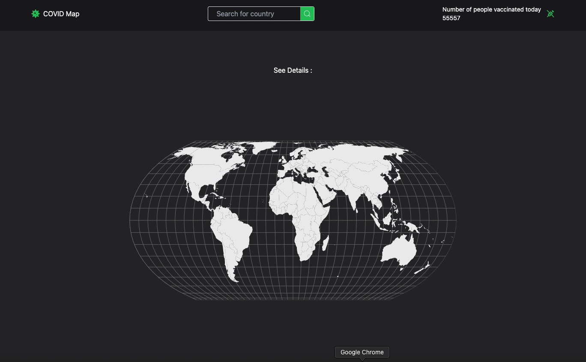

# <h1>TypeScript-CovidMap-App</h1>

This website provides data on current coronavirus cases by country. Unit tests of the application have been done.

<h2> Programming Languages Used</h2>

Website is coded with JSX CSS/TAILWIND & REACT.JS

# Librarys
- react-router-dom
- react-icons
- tailwind
- react-simple-maps
- reduxjs/toolkit
- react-redux
- @testing-library/user-event@14.0
- axios@^0.27.2
- react-testing-library
- jest

<h2>Screen </h2>

